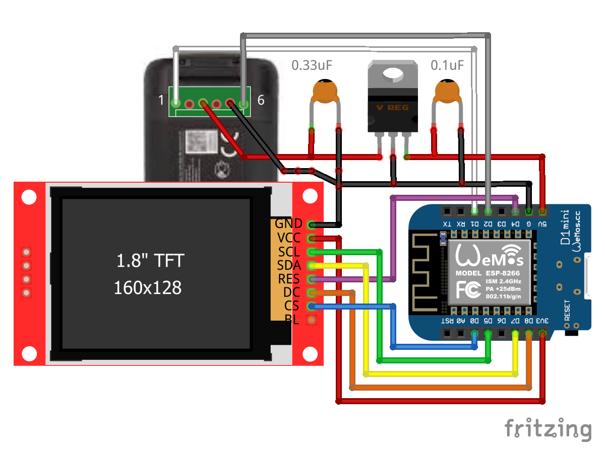

# DJI Mavic Mini Battery Info

As the Mavic Mini battery lacks a charge level indicator, this device queries the I2C smart battery chip and allows you to check charge level, battery status, and other information.

This fork has been modified to use an ESP8266 (Wemos/Lolin D1 Mini) instead of an Arduino Nano.  The Nano is easier to implement, as it can operate natively at the power levels delivered by the battery.

Serial output example:
```
Manufacturer Name: SDI
Device Name: BA01WM160
Chemistry 2044
Manufacturer Data:  
Design Capacity: 2400
Design Voltage: 7200
Manufacture Date (D.M.Y): 20.1.2020
Serial Number: 1U5X02MEXP0ARB
Specification Info: 49
Cycle Count: 10
Voltage: 8.14
Full Charge Capacity: 2302
Remaining Capacity: 2080
Relative Charge(%): 91
Absolute Charge(%): 87
Minutes remaining for full charge: -1
Cell 1 Voltage: 4067
Cell 2 Voltage: 4068
State of Health: 0
Battery Mode (BIN): 0b110000000000001
Battery Status (BIN): 0b11000000
Charging Current: 4750
Charging Voltage: 8400
Temp: 23.75
Current (mA): -131
```

### Required Parts

- Wemos/Lolin D1 Mini (I used [this](https://www.aliexpress.com/item/32529101036.html?spm=a2g0o.store_pc_home.productList_2559240.pic_1))
- [1.8" 128x160 SPI LCD Display Module ST7735](https://www.aliexpress.com/item/33031122936.html)
- L7805 Voltage Regulator, or similar
- 1x 0.33uF and 1x 0.1uF capacitors - Note: I used 0.22uF and 0.1uF

### 3D Printed Case
- [3D printed case (Updated, OpenSCAD parametrized... mostly)](https://www.thingiverse.com/thing:4602325)
- The case has a cutout that fits a JST PHR-6 connector and header.  The header pins slot into the Mavic Mini battery. 

### Pin Connections
 
| Wemos D1 Mini | GPIO PIN  | SPI  TFT | Battery |
|:-------------:|:---------:|:--------:|:-------:|
|    5V         |           |          |    3    |
|    GND        |           |   GND    |    5    |
|    D4         |   GPIO2   |   RES    |         | 
|    D2         |   GPIO4   |          |    6    |
|    D1         |   GPIO5   |          |    1    |
|    3.3v       |           |   VCC    |         |
|    D8         |   GPIO15  |   DC     |         |
|    D7         |   GPIO13  |   SDA    |         |
|    D5         |   GPIO14  |   SCL    |         |
|    D0         |   GPIO16  |   CS     |         | 

The L7805 Voltage Regulator sits between the battery and the 5V pin on the Wemos. 



## Compiling

### Required Libraries
- (Tools -> Manage Libraries...)
- [Bodmer TFT_eSPI](https://github.com/Bodmer/TFT_eSPI)

### Modify TFT_eSPI for your display
${USER}/Documents/Arduino/libraries/TFT_eSPI/User_Setup_Select.h
Change the following lines to be as shown:
```
//#include <User_Setup.h>
#include <User_Setups/Setup2_ST7735.h>   // Setup file configured for my ST7735
```

${USER}/Documents/Arduino/libraries/TFT_eSPI/User_Setups/Setup2_ST7735.h
Change the following lines to be as shown:
```
#define ST7735_GREENTAB

#define TFT_CS   16  // Chip select control pin D8
#define TFT_DC   15  // Data Command control pin
```
